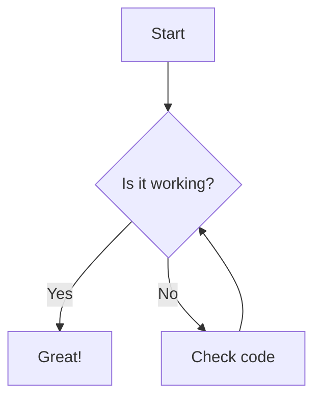
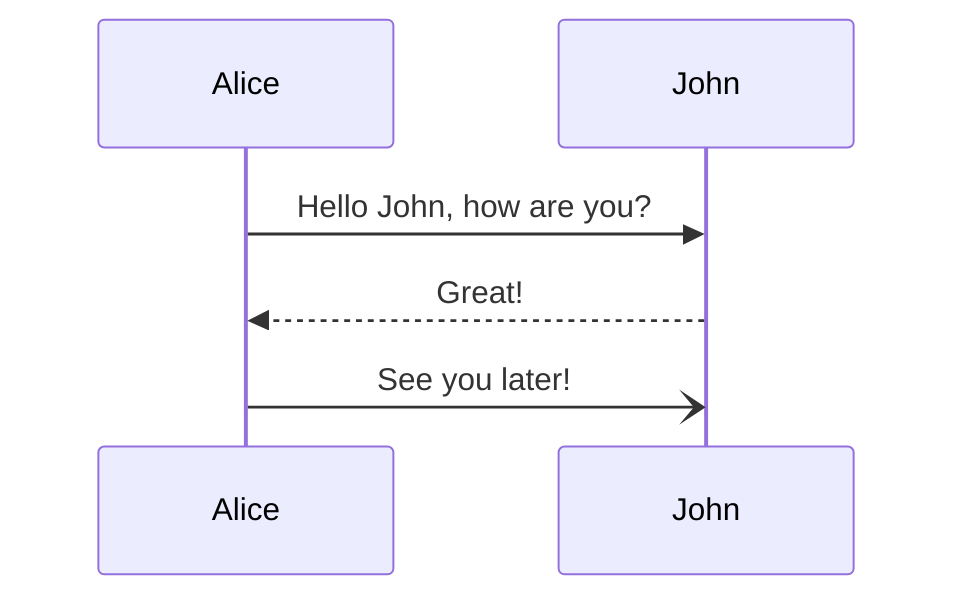

# Welcome to Mermaid Editor

This is a Markdown editor with live Mermaid diagram rendering.

## Flowchart Example

```mermaid
graph TD
    A[Start] --> B{Is it working?}
    B -- Yes --> C[Great!]
    B -- No --> D[Check code]
    D --> B
```

## Sequence Diagram Example

```mermaid
sequenceDiagram
    Alice->>John: Hello John, how are you?
    John-->>Alice: Great!
    Alice-)John: See you later!
```
